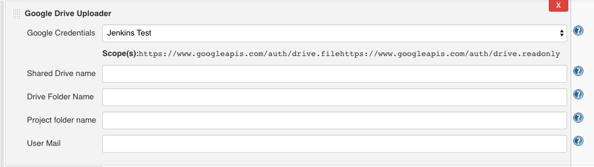

Jenkins Google Driver Uploader
===
This plugin allows you to upload artifacts to your google service account.

# Install

Create an HPI file to install in Jenkins (HPI file will be in
`target/google-drive-upload.hpi`).

    mvn clean package

# ScreenShot

# Usage with [Jenkins Job DSL Plugin](https://github.com/jenkinsci/job-dsl-plugin)
For uploading to My Drive

    job("my_job") {
        ...
        publishers {
            googleDriveUploader {
                credentialsId('jenkins-211812')
                driveFolderName('my_driver_folder')
                uploadFolder('folder_to_upload ')
                userMail('me@localtest.me')
            }
        }
    }    
        
For uploading to Shared drives

    job("my_job") {
        ...
        publishers {
            googleDriveUploader {
                credentialsId('jenkins-211812')
                sharedDriveName('My-Shared-Drive-Name')
                driveFolderName('my_driver_folder')
                uploadFolder('folder_to_upload ')
            }
        }
    }    
        
# Usage in [Jenkins pipeline](https://jenkins.io/doc/book/pipeline/)
For uploading to My Drive

    steps {
        googleDriveUpload credentialsId: 'jenkins-211812',
                driveFolderName: 'my_driver_folder', 
                uploadFolder: 'folder_to_upload',
                userMail: 'me@localtest.me'
    }        

For uploading to Shared drives

    steps {
        googleDriveUpload credentialsId: 'jenkins-211812',
                sharedDriveName: 'My-Shared-Drive-Name',
                driveFolderName: 'my_driver_folder', 
                uploadFolder: 'target/**/*.pdf, docs/*.pdf'
    }        

# Thanks

[Marko Stipanov](https://github.com/mstipanov) for creating [Jenkins Google Driver Uploader](https://github.com/mstipanov/google-drive-upload-plugin). This helps us a lot to create this plugin.

# References 
* [Parent POM for Jenkins Plugins](https://github.com/jenkinsci/plugin-pom)
* [Jenkins Google OAuth Credentials Plugin](https://github.com/jenkinsci/google-oauth-plugin)
* [Google Drive API v3 Reference](https://developers.google.com/drive/api/v3/reference)
* [Google API Client Library for Java ](https://developers.google.com/api-client-library/java)